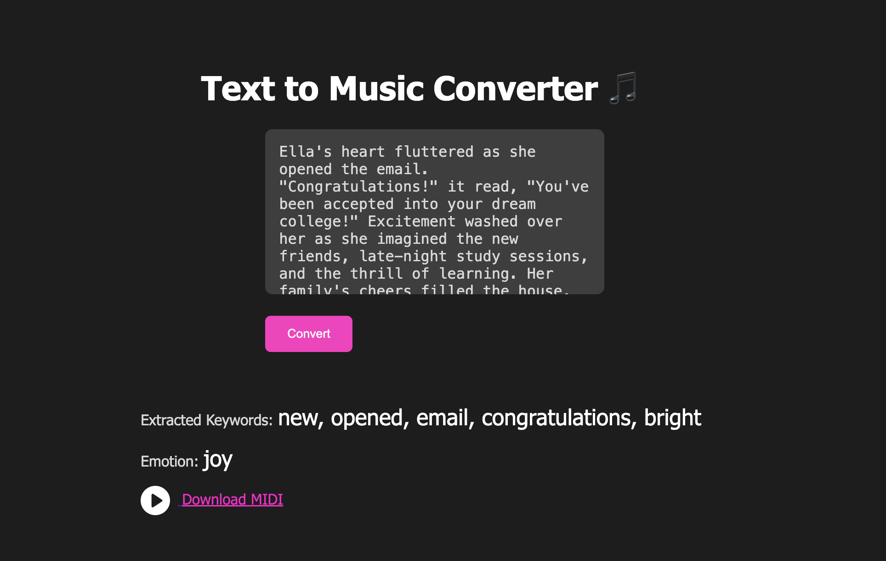
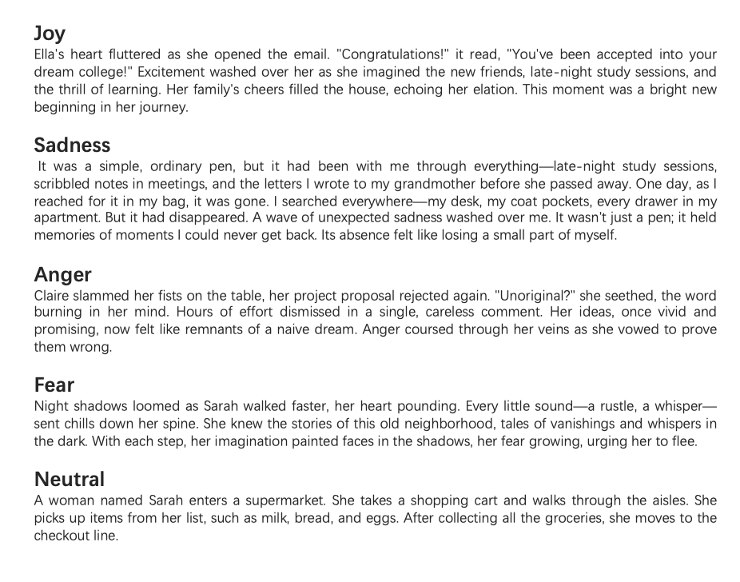

# Emotion-Driven Music Generation: Converting Narratives into MIDI Music

## Code reference

The code in the links below is reasonably referenced and heavily modified.

### Keyword extraction

Refer to the basic structure of the Textrank model and modify the details.

https://github.com/abner-wong/textrank

### Emotion recognition

I referred to the CNN model construction in this project, as well as how to calculate and visualize the F1 score, and made substantial modifications based on the code.

https://github.com/lukasgarbas/nlp-text-emotion

### MIDI generation

The basic file for MIDI music generation, which provides basic tools for MIDI file generation, defines various MIDI times, such as notes, rhythms, etc., and can output the arranged notes and events in MIDI format. My project will refer to the most basic generation template, and make substantial modifications on this basis, adding emotions and keyword elements.

https://github.com/TheGreatAthlon/music-generator?tab=readme-ov-file

##  LLM disclaimer

1. Using ChatGPT to help understand some online sample code.

2. Using ChatGPT to help find a solution when part of the code runs wrong.
   
3. When building the display webpage, refer to the solution given by ChatGPT and make substantial modifications after reference.

4. When viewing English tutorials and literature, use DeepL and ChatGPt to help with translation comprehension.

## Dataset

### Emotion Classification

The text analysis module dataset mainly consists of text messages and conversations, which are merged from dailydialog, isear, and emotion-stimulus. The dataset maps sentences to emotions one by one, and contains a total of 5 emotion labels: joy, sadness, anger, fear, and neutral.

Dailydialog: http://yanran.li/dailydialog.html
Emotion-stimulus: http://www.site.uottawa.ca/~diana/resources/emotion_stimulus_data
Isear: http://www.affective-sciences.org/index.php/download_file/view/395/296/

### embeddings/wiki-news-300d-1M.vec

Word embedding uses 300 dimentional w2v pre-trained on Wikipedia articles, which contains word vectors of one million words pre-trained by the FastText model. It reflects the position of words in a specific emotional or semantic space, and establishes semantic relationships between emotional words (such as "anger" and "sadness") and specific words in a sentence, which can help the model better understand the emotional connotation of a sentence.

https://fasttext.cc/docs/en/english-vectors.html

## Text Analysis

### keyword_extraction.py

The keyword extraction process based on the `TextRank` algorithm is as follows: First, the text undergoes preprocessing, including punctuation removal, conversion to lowercase, tokenization, and stopword removal. Next, a sliding window is used to record word co-occurrence relationships, which are stored in an adjacency matrix. Then, `networkx` is utilized to convert the matrix into a graph and compute the importance scores for each word. Finally, the top five words with the highest scores are extracted as keywords, which will be used for subsequent music generation.

### cnn_w2v_wiki.ipynb

Use this file to train the CNN model and obtain a pre-trained model for subsequent emotion recognition.

### text_emotion.py

A CNN model is built, which effectively extracts local patterns from the input text and performs sentiment classification through a combination of embedding layers, convolutional layers, pooling layers, and fully connected layers, converting the text into five emotions (joy, sadness, anger, fear, and neutral).

## MIDI generation

### music_generator/generate.py

This code is used to generate MIDI music based on a given keyword and emotional context. Keywords are used to determine the notes, and emotions are used to set the rest of the music parameters, such as tempo, volume, and instrument type.

## Web design

### Web.py

This code sets up a Flask web application that converts text input into sentiment, and opens the web page by running this code.

### templates/index.html

This HTML file creates a web interface. It includes a title page, a form with a text input area, a result display area (including extracted keywords and sentiment), a play button to listen to the generated MIDI file, and a link to download the file.

### static/js/script.js

This JavaScript code handles the form submission for the "Text to Music Converter." 

### static/css/style.css

This CSS file defines the styling for the "Text to Music Converter" web page.Including styles for titles, input boxes, output text, etc.

## output

The output folder contains interface display pictures, five story examples with different emotions, and the corresponding audio and video files of generated MIDI music.

